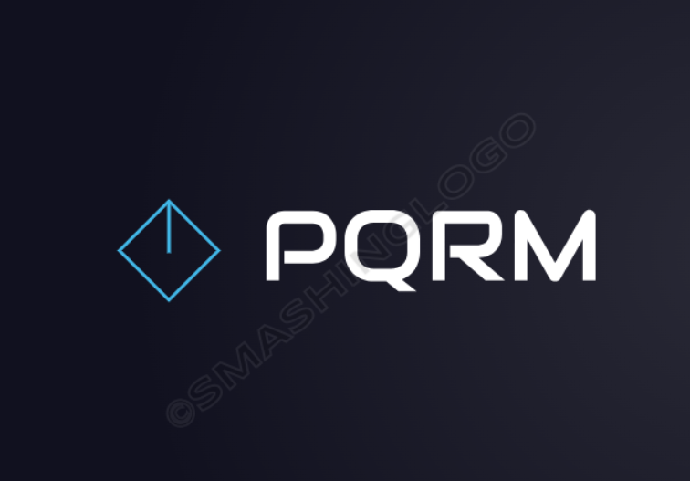

<p align="center">
  <a href="https://laravel.com" target="_blank">
    
  </a>
</p>

<p align="center">
  <a href="https://github.com/laravel/framework/actions">
    
  </a>
  <a href="https://packagist.org/packages/laravel/framework">
    
  </a>
  <a href="https://packagist.org/packages/laravel/framework">
    
  </a>
  <a href="https://packagist.org/packages/laravel/framework">
    
  </a>
</p>
<p align="center">
  
</p>

# PQR_MANAGER


**PQR_MANAGER** es una aplicación web diseñada para gestionar PQRs (Peticiones, Quejas y Reclamos). Utilizando el framework Laravel, esta aplicación proporciona un sistema robusto y eficiente para registrar, seguir y resolver PQRs de manera efectiva. Su objetivo es mejorar la comunicación entre los usuarios y los administradores, facilitando un proceso de gestión transparente y accesible.

## Características

- **Gestión de Usuarios**: Crea, edita y elimina usuarios en el sistema.
- **Registro de PQRs**: Permite a los usuarios enviar sus PQRs con facilidad.
- **Estado de PQRs**: Los usuarios pueden consultar el estado de sus PQRs en tiempo real.
- **Notificaciones**: Envía notificaciones a los usuarios sobre actualizaciones de sus solicitudes.
- **Interfaz Amigable**: Diseño intuitivo que facilita la navegación y uso del sistema.

## Tecnologías Utilizadas

- [Laravel](https://laravel.com)
- [PHP](https://www.php.net)
- [MySQL](https://www.mysql.com)
- [Sanctum](https://laravel.com/docs/sanctum) para autenticación API
- [Git](https://git-scm.com) para control de versiones


## Instalación

Sigue los siguientes pasos para configurar el proyecto en tu entorno local:

1. **Clonar el repositorio:**
   ```bash
   git clone https://github.com/xcarlosg/pqr-manager.git
   cd pqr-manager


2. **Instalar las dependencias:**
```bash
composer install

3. **Configurar el archivo** .env: Copia el archivo .env.example a .env y configura las variables de entorno, incluyendo la configuración de la base de datos.

4. **Configurar el archivo** 
```bash
php artisan key:generate

5 **Configurar el archivo** 
```bash
php artisan migrate

6. ** Iniciar el servidor:** 
```bash
Copiar código
php artisan serve


7. Configurar la base de datos
Actualiza las credenciales de tu base de datos en el archivo .env:
env
Copiar código
DB_CONNECTION=mysql
DB_HOST=127.0.0.1
DB_PORT=3306
DB_DATABASE=pqr_manager
DB_USERNAME=tu_usuario
DB_PASSWORD=tu_contraseña


Migraciones
Las migraciones incluidas en el proyecto crean las tablas necesarias para la gestión de usuarios y PQRs. Aquí están los detalles de las tablas:

Tabla users:

user_id: Clave primaria.
user_identification: Identificación única del usuario.
user_name: Nombre del usuario.
user_lastname: Apellido del usuario.
user_email: Correo electrónico único del usuario.
user_password: Contraseña encriptada del usuario.
user_rol: Rol del usuario en la aplicación.
Tabla pqrs:

pqr_id: Clave primaria.
pqr_date: Fecha de la solicitud PQR.
pqr_type: Tipo de PQR (Petición, Queja, Reclamo).
pqr_methodnotify: Método de notificación (booleano).
pqr_cause: Causa de la solicitud.
pqr_observation: Observaciones adicionales.
pqr_evidence: Evidencias anexadas (opcional).
user_id: Referencia al usuario que realizó la solicitud.
css

#Ejecutar migraciones
Aplica las migraciones a la base de datos para crear las tablas necesarias:
```bash
Copiar código
php artisan migrate

Uso de la API
El backend de PQR_MANAGER expone una serie de endpoints RESTful para gestionar las PQRs y usuarios. A continuación, se presenta un resumen de algunos de los principales endpoints:

Endpoints de usuarios:
GET /api/users: Obtener todos los usuarios registrados.
POST /api/users: Registrar un nuevo usuario.
GET /api/users/{id}: Obtener un usuario específico por ID.
PUT /api/users/{id}: Actualizar los datos de un usuario.
DELETE /api/users/{id}: Eliminar un usuario.
Endpoints de PQRs:
GET /api/pqrs: Obtener todas las PQRs registradas.
POST /api/pqrs: Registrar una nueva PQR.
GET /api/pqrs/{id}: Obtener una PQR específica.
PUT /api/pqrs/{id}: Actualizar los detalles de una PQR.
DELETE /api/pqrs/{id}: Eliminar una PQR.


Aquí hay una descripción general de la estructura del proyecto para ayudarte a navegar entre los archivos:

Estructura del proyecto
/app: Contiene los controladores, modelos y la lógica de negocio del backend.
/resources/views: Vistas del frontend si se utilizan plantillas Blade.
/routes/web.php: Define las rutas de la aplicación web.
/routes/api.php: Define las rutas de la API (añadir este archivo si no existe).
/database/migrations: Contiene las migraciones de la base de datos para crear las tablas users y pqrs.
Contacto
Si tienes preguntas o sugerencias, no dudes en ponerte en contacto:

Nombre: Carlos M. Gonzalez M.
Correo electrónico: [carlosmgm@gmail.com](mailto:carlosmgm@gmail.com)